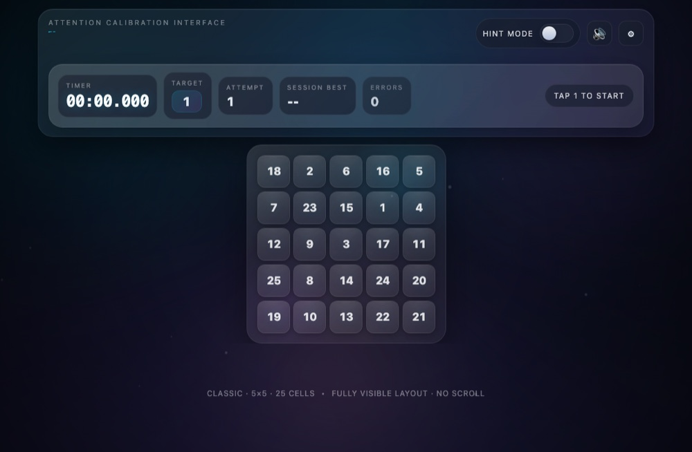

# Schulte Grid

**▶ [Train now](https://renrenmimi.github.io/Schulte-Grid/)** — runs in your browser, nothing to install.

Numbers scattered across a grid. Find them in order, as fast as you can, moving your eyes
instead of your head. A standard drill for attention span and peripheral vision.

## Features

- **Adjustable difficulty** — grid size scales with you
- **Precision tracking** — accuracy is scored, not just speed
- **Play again** without leaving the run

## Tech

One `index.html` file.
